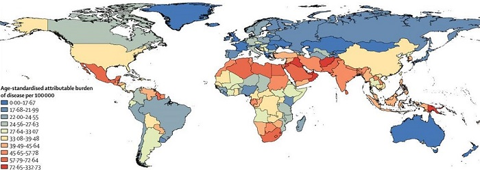
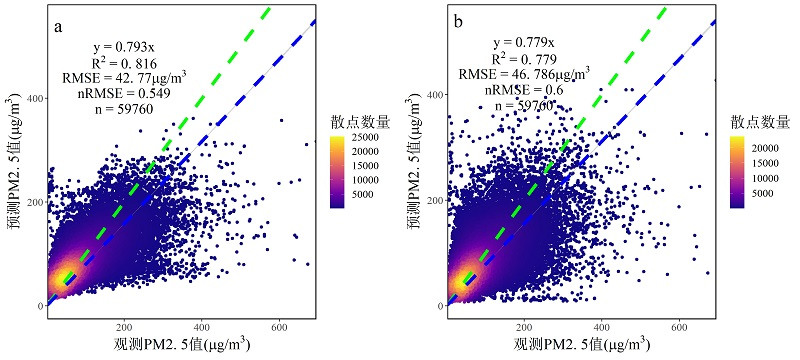
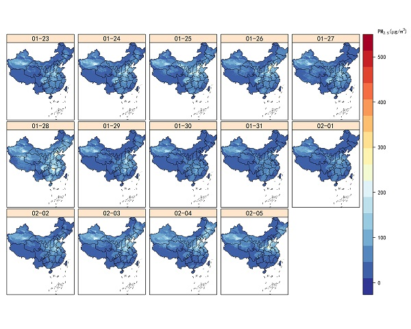
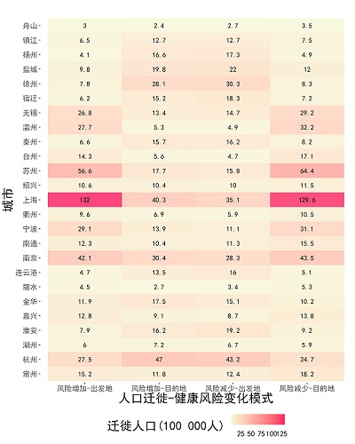
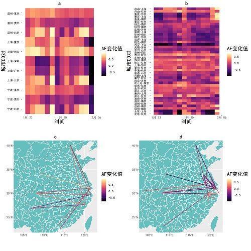

# 大纲

### 1.研究背景
### 2.研究问题与目标
### 3.研究数据方法
### 4.研究结果
### 5.讨论与结论

---
class: left

# 1.研究背景

### PM2.5为代表的环境细颗粒物（Fine Particulate Matter）污染已经成为严重威胁公众健康的环境风险因子。

- 人口的快速增长、工业化与城市化进程的快速推进，城市空气污染日益严重;

- 对于呼吸系统的损害；

- 与糖尿病，心血管等慢性病患病率的高关联性；

- 降低体力活动频率；

- 对全球疾病负担的贡献率位列第六。

--


---
class: left

# 1.研究背景

### PM2.5污染长期暴露的健康效应研究

PM2.5污染长期暴露造成的死亡人数以及预期寿命的减少。基于长期纵向或队列研究较为可靠。

- 中国2013年因PM2.5暴露导致的死亡人数约在107-137万人之间，大约占到全部死亡人数的30%；

- PM2.5污染也使得中国人预期寿命下降1.25年。

### PM2.5污染短期暴露的健康效应研究

严重的疾病与经济负担。研究较少。

- 疾病负担：死亡率增加，急性下呼吸道感染增加，精神疾病急诊入院率增加，心脏系统疾病致死率增加，急性冠状动脉事件风险增加；

- 经济负担：平均每1微克每立方米的PM2.5短期暴露会造成每年2 050例住院病例的增加以及3 100万美元的住院费用。

---
class: left

# 2.研究问题与目标

### 2.1 难点


- PM2.5污染具有强烈的时空异质性；
- 暴露人群不同的社会经济环境与复杂的人类移动。
- 以上两点造成PM2.5短期污染暴露健康效应存在强烈的时空分异性。

### 2.2 关键科学问题

- **由于过去难以精准刻画短期大规模的时空动态人口与精细尺度的PM2.5时空分布，如何准确估算大区域上PM2.5污染短期暴露导致的健康效应仍然存在较大的研究空白。**

### 2.3 研究目标

- 本研究拟利用机器学习等人工智能算法实现PM2.5的大区域高时空分辨率制图，结合腾讯位置大数据，以长三角城市群为例，针对中国一年一度的春节人口大迁徙导致人群PM2.5污染短期暴露环境产生的变化，估算其造成的健康效应变化程度，探究不同城市PM2.5污染短期暴露健康效应变化差异。本研究旨在通过实证研究探讨：**春节人群迁徙行为影响下PM2.5污染短期暴露环境及其健康效应的时空变化**。
---
class: left

# 3.研究数据与方法

### 3.1 研究数据

- 研究区

```{r echo=FALSE, fig.height=3, fig.width=10, message=FALSE, warning=FALSE}
library(maptools)
library(sp)
library(sf)
library(leaflet)

yrtcity <- st_read('../data/yrtcity.shp')
yrtcity <- as_Spatial(yrtcity)
pm25station <- read.csv('M:/ITC/sptaialbehaviorECNU/data/stationlocation.txt', encoding = 'UTF-8')


leaflet() %>%
  addTiles(group = 'basemap') %>%
  addPolygons(data = yrtcity, group = 'study area') %>%
  addCircleMarkers(data = pm25station, lng = pm25station$lng, lat = pm25station$lat, 
                   color = 'red',
                   group = 'PM2.5 station') %>%
  addLayersControl(baseGroups = c("basemap"),
                   overlayGroups = c('study area', 'PM2.5 station'),
                   options = layersControlOptions(collapsed = TRUE)
                   ) 
```

---
class: left

# 3.研究数据与方法

### 3.2 研究方法

- PM2.5时空制图

$$PM25_{i,t} = f(PM25_{i,a}, H_{i}, Temp_{i,t}, DP_{i,t}, Press_{i,t}, Precip_{i,t}, Wind_{i,t}, doy)$$

本研究这里选用随机森林（Random Forest）与极端梯度提升树算法拟合模型，用空间块交叉验证评估精度。

- PM2.5短期暴露健康效应估算

$$AF = 1- e^{-\beta \Delta C}$$

△C是由于春运迁徙导致的人群PM2.5污染短期暴露环境变化程度，定义为目的地城市空气污染浓度与出发地城市空气污染浓度之差的绝对值。根据这个差值的正负性区分健康风险的增减。


---
class: left

# 4.研究结果

### 4.1 长三角区域人口春节迁徙行为

```{r echo=FALSE, fig.height=7, fig.width=12, message=FALSE, warning=FALSE}
library(ggplot2)
tsadf <- read.csv('../data/tsadfu.csv')
tsadf$datef <- as.Date(tsadf$datef)
ggplot(tsadf) + 
  #geom_point(mapping = aes(x = datef, y = pop/1000, colour = city_d)) + 
  #geom_line(mapping = aes(x = datef, y = pop/1000, colour = city_d)) + 
  geom_polygon(data = data.frame(x = c(as.Date('2017-01-23'), as.Date('2017-01-23'), 
                                       as.Date('2017-01-30'), as.Date('2017-01-30')),
                                 y = c(min(tsadf$pop/1000), max(tsadf$pop/1000), 
                                       max(tsadf$pop/1000), min(tsadf$pop/1000))), 
               mapping = aes(x = x, y = y), 
               colour = NA, fill = '#fce38a', alpha = 0.4) +
  geom_polygon(data = data.frame(x = c(as.Date('2017-01-30'), as.Date('2017-01-30'), 
                                       as.Date('2017-02-05'), as.Date('2017-02-05')),
                                 y = c(min(tsadf$pop/1000), max(tsadf$pop/1000), 
                                       max(tsadf$pop/1000), min(tsadf$pop/1000))), 
               mapping = aes(x = x, y = y), 
               colour = NA, fill = '#f08a5d', alpha = 0.4) +
  annotate(geom = 'text', x = as.Date('2017-01-26'), y = 450, 
           label = '春节前一周', colour = 'black', size = 3.2) +
  annotate(geom = 'text', x = as.Date('2017-02-02'), y = 450, 
           label = '春节后一周', colour = 'black', size = 3.2) +
  geom_point(mapping = aes(x = datef, y = pop/1000), colour = '#3490de', size = 1.8) + 
  geom_line(mapping = aes(x = datef, y = pop/1000), colour = '#3490de', size = 1.2) +
  geom_hline(yintercept = 0, colour = '#071a52', size = 1, linetype = 2) +
  labs(x = '日期', y = '迁徙净人口 (1 000 人)') +
  #scale_color_manual(values = colorspic) + 
  facet_wrap(~city_d) + 
  theme(panel.background = element_blank(),
        legend.position = 'None',
        axis.text = element_text(family = "RT", size = 15),
        title = element_text(family = "RT", size = 20),
        strip.text = element_text(family = "RT", size = 20),
        panel.border = element_rect(colour = 'black', fill = NA, size = 1.2))
```

---
class: left

# 4.研究结果

### 4.2 PM2.5时空制图

- 交叉验证结果


---
class: left

# 4.研究结果

### 4.2 PM2.5时空制图

- 制图结果




---
class: left

# 4.研究结果

### 4.3 PM2.5污染短期暴露健康风险




---
class: left

# 4.研究结果

### 4.3 PM2.5污染短期暴露健康风险


---
class: left

# 5.讨论与结论

### 5.1 讨论

- PM2.5站点具有显著的空间自相关性，普通的交叉验证可能会导致模型过拟合，在区域制图时可能会导致极大的不确定性。这种情况下采用空间交叉验证方法可以有效地评估模型精度，避免由于训练数据的空间自相关性带来的模型过拟合问题。

- 应用层面丰富了宏观区域PM2.5污染短期暴露健康效应的研究。同时，集成多源时空数据的高时空分辨率制图实现PM2.5环境暴露的精准测度是对空间全生命周期流行病学十大热点问题中的精准测度环境暴露指标的一次实证研究探索，也丰富了空间全生命周期流行病学在空气污染暴露领域的实际应用。

---
class: left

# 5.讨论与结论

### 5.2 结论

- 春节迁徙行为导致长三角地区PM2.5污染短期暴露健康风险增加和减少人数分别为6 070万和6 175万人；

- 健康风险增加值最高值在0.78与0.96之间，均值在0.25与0.39之间；

- PM2.5污染短期暴露健康效应的时空异质性更强烈，前一天与后一天的暴露健康风险变化值可以达到1.5以上。

- 长三角地区的7个城市大部分迁徙人口由于春节迁徙行为导致PM2.5污染短期暴露健康风险增加，包括无锡，温州，台州，苏州，上海，宁波，南京，暴露人口从143万到1 320万不等。

- 6个城市的一半迁徙人口由于春节迁徙行为导致PM2.5污染短期暴露健康风险增加，包括舟山，绍兴，南通，丽水，嘉兴，湖州，暴露人口从30万到155万不等。

- 本研究仍然存在一些限制，如腾讯人口迁徙数据获取不够完整，仅有每个城市迁入迁出前10城市的数据，PM2.5时空制图的精度还可以进一步提升等，这些都有待于进一步分析与探究。

---
class: left

# 谢谢

- 文章信息：戴劭勍, 李佳佳, 杨维旭, 陈方煜, 江辉仙. (2020). 春节期间的 PM2.5 污染短期暴露健康效应评估——以长三
角地区 25 个城市为例. 上海城市规划. 05, 22-29. doi:10.11982/j.supr.20200504. 

- 微信公众号推送文章：https://mp.weixin.qq.com/s/tpBS511WWOWau5jHaneoZg

